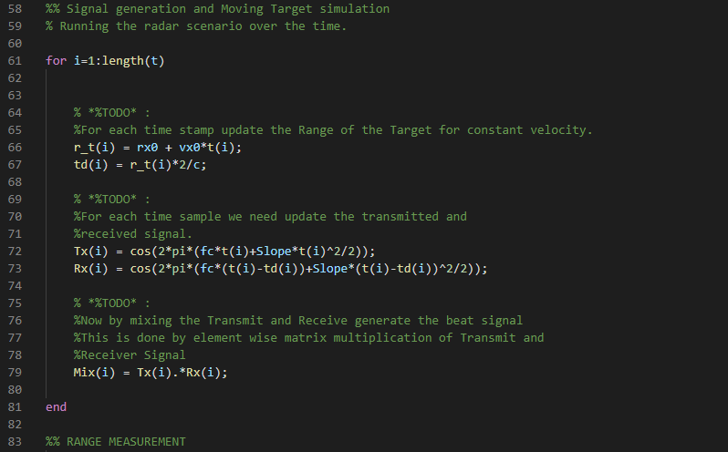

# SFND Radar Target Generation and Detection

## 1. Goal
By completing all the lessons, I learned FMCW, 2D FFT and 1D CFAR.   
In this project, I implemented the whole steps including 2D CFAR, as shown below.

- Configure the FMCW waveform based on the system requirements.
- Define the range and velocity of target and simulate its displacement.
- For the same simulation loop process the transmit and receive signal to determine the beat signal.
- Perform Range FFT on the received signal to determine the Range.
- Towards the end, perform the CFAR processing on the output of 2nd FFT to display the target.

## 2. Steps and Results
## (1) Radar System Requirements
  
System Requirements defines the design of a Radar. The sensor fusion design for different driving scenarios requires different system configurations from a Radar. In this project, I designed a Radar based on the given system requirements (above).

Max Range and Range Resolution are considered here for waveform design.

- The sweep bandwidth can be determined according to the range resolution and the sweep slope is calculated using both sweep bandwidth and sweep time.
- The sweep time can be computed based on the time needed for the signal to travel the unambiguous maximum range. In general, for an FMCW radar system, the sweep time should be at least 5 to 6 times the round trip time. This example uses a factor of 5.5.

The Matalb code is following.  
For the target object, I set the initial range = 100[m] and constant vecocity = -10[m/s].
  

## (2) Target Generation and Detection
  
Next, I simulated the signal propagation and moving target scenario.
The Matlab code is following.
  
  

## (3) FFT Operation
Next, I implemented the 1D FFT on the Mixed Signal by reffering to the following steps.
- Reshape the vector into Nr*Nd array.
- Run the FFT on the beat signal along the range bins dimension (Nr)
- Normalize the FFT output.
- Take the absolute value of that output.
- Keep one half of the signal
- Plot the output
- There should be a peak at the initial position of the target  

The Matalb code is following.  
  

The result of 1st FFT is shown below.  
  

The 2nd FFT is already implemented in the code. It generated a Range Doppler Map as seen in the image below and it will be given by variable ‘RDM’. Next task is to implement the CFAR on this Range Doppler Map.  
The Matalb code is following.  
I separated "RDM" as power and "RDM_db" as decibel to use "RDM" as power in the next step. 
  

The result of 2nd FFT is shown below.  
  

## (4) 2D CFAR
Finally, I implemented 2D CFAR according to the steps as below.
- Determine the number of Training cells for each dimension. Similarly, pick the number of guard cells.
- Slide the cell under test across the complete matrix. Make sure the CUT has margin for Training and Guard cells from the edges.
- For every iteration sum the signal level within all the training cells. To sum convert the value from logarithmic to linear using db2pow function.
- Average the summed values for all of the training cells used. After averaging convert it back to logarithmic using pow2db.
- Further add the offset to it to determine the threshold.
- Next, compare the signal under CUT against this threshold.
- If the CUT level > threshold assign it a value of 1, else equate it to 0.

The Matalb code is following.  
I set 10 Training Cells and 4 Guard Cells in each Range and Doppler axis. Dimension became 2D, so I set the number of Training Cells a little less than Lesson 4 to reduce calculation time.  
I set offset = 5, same as Lesson 4.  

  
  
  

The result of 2D CFAR is shown below.  
It's shows a good result of my setting, the initial range = 100[m] and constant vecocity = -10[m/s].
  